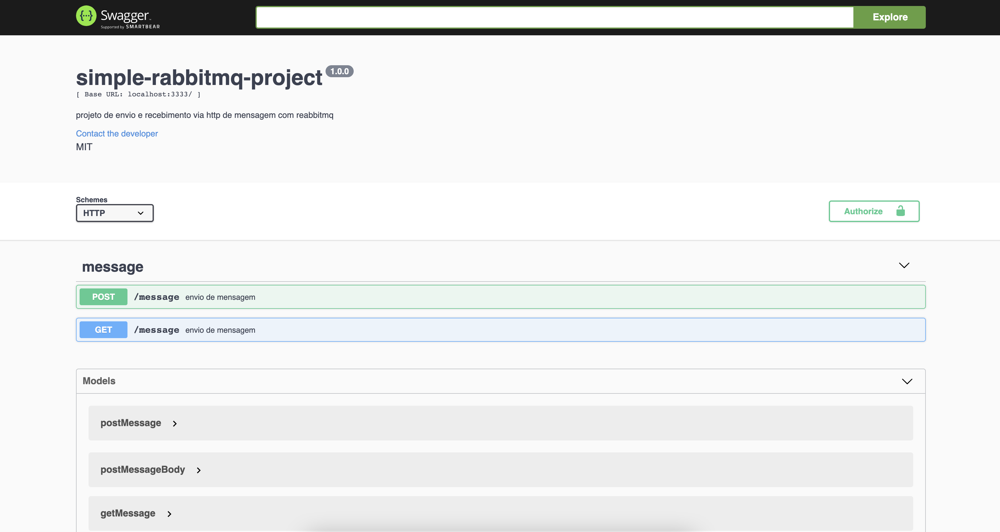

# RabbitMQ com Express

O projeto utiliza NodeJs na versão 14.

## Passos para executar o Projeto

 1. baixar o projeto em zip ou clonar com o comando:
    > `git clone https://github.com/tellesdourado/simple-rabbitmq-project.git`
 2.  para rodar o projeto com docker use o comando:
		> `docker-compose up --build -d`
 3. para rodar manual é necessário que você tenha um RabbitMQ rodando, troque as configurações no arquivo `.env` e depois rode os comandos abaixo:
	>  `npm install`
	>  `npm run dev`
4. você pode encontrar a documentação na rota `/docs`
5. para fazer uma build para es5 rode o comando `npm run build`
6. para rodar a build em es5 `npm run build:start`
7. para rodar os testes de integração `npm run test`

## Documentação

Ambiente local: http://localhost:3333/docs

